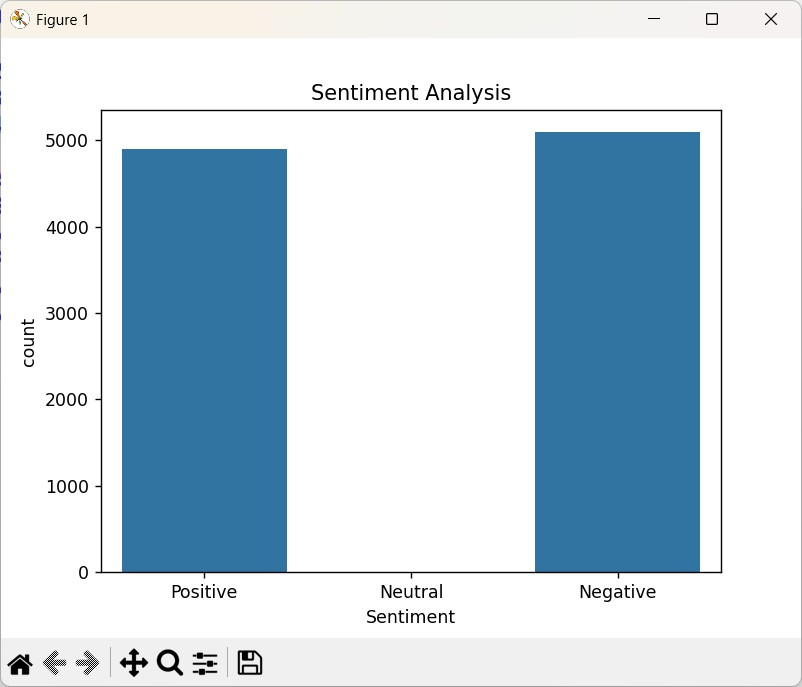

# Sentiment Analysis using Python and Machine Learning

## 📌 Project Overview
This project performs Sentiment Analysis on Amazon customer reviews using Natural Language Processing (NLP) and Machine Learning techniques. The model classifies reviews into Positive, Negative, and Neutral sentiments based on review scores and text comments.

The project also includes data visualization techniques such as Pie Charts, Bar Charts, and Word Clouds to better understand customer feedback patterns.

---

## 🚀 Features
- Data Cleaning and Preprocessing
- Sentiment Classification
- Natural Language Processing (NLP)
- Data Visualization using Matplotlib and Seaborn
- Word Cloud Generation
- Machine Learning using Logistic Regression
- Model Accuracy Evaluation
- Classification Report Analysis

---

## 🛠️ Technologies Used
- Python
- Pandas
- Matplotlib
- Seaborn
- Scikit-learn
- WordCloud

---

## 📂 Dataset
The project uses an Amazon Reviews dataset containing:
- Customer comments
- Review scores
- Sentiment labels

---

## 📊 Visualizations Included
- Sentiment Distribution Pie Chart
- Sentiment Count Bar Chart
- Word Cloud of Customer Reviews

---

## 🤖 Machine Learning Model
### Logistic Regression
The project uses Logistic Regression for sentiment classification.

### Model Evaluation Metrics
- Accuracy Score
- Precision
- Recall
- F1-Score

---

## 📈 Sample Output
- Positive Reviews Detection
- Negative Reviews Detection
- Sentiment Visualization
- Classification Performance Report

---

## ▶️ How to Run the Project

### Step 1: Install Required Libraries
```bash
pip install pandas matplotlib seaborn scikit-learn wordcloud
```

### Step 2: Run the Python File
```bash
python "Sentimanental Analysis.py"
```

---

## 📸 Project Screenshot
Add your project screenshots here after uploading images to GitHub.

## Dashboard Screenshots

### Bar Chart for Sentiment Analysis



---

## 📚 Learning Outcomes
This project helps in understanding:
- NLP Basics
- Text Classification
- Machine Learning Workflow
- Data Visualization
- Model Evaluation Techniques

---

## 👨‍💻 Author
Jayanta Chakraborty

---

## 📌 Internship Task
This project was created as part of the CodeAlpha Internship Program.
